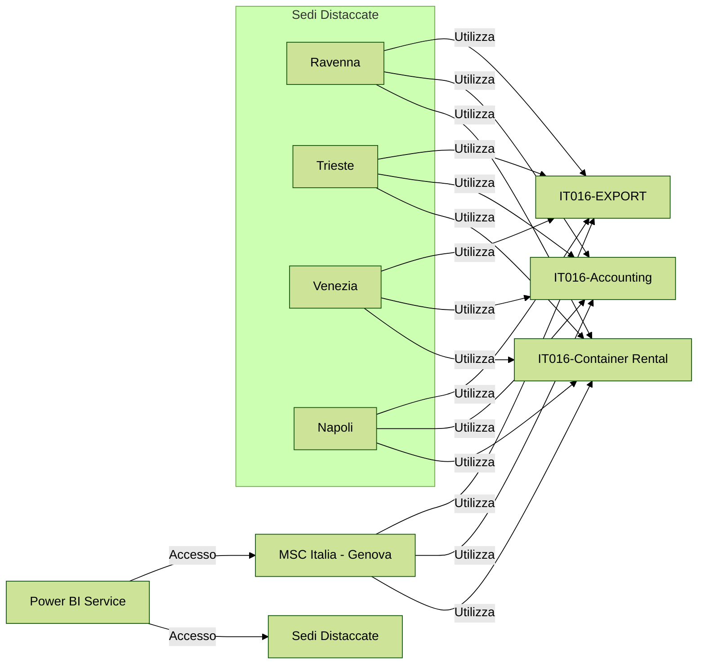

# Utilizzo delle App Power BI da parte di MSC Italia e delle Sedi Distaccate

Questo documento illustra come, partendo dal **Power BI Service**, sia la sede centrale di **MSC Italia a Genova** che le sedi distaccate di **Ravenna**, **Trieste**, **Venezia** e **Napoli** possono utilizzare diverse sorgenti dati tramite le tre app Power BI: **IT016-EXPORT**, **IT016-Accounting** e **IT016-Container Rental**.

---

## Schema Generale di Utilizzo

