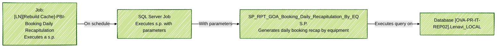

# SQL Server Job Execution Diagram

## Container Diagram for SQL Server Job

Il seguente diagramma rappresenta l'esecuzione della stored procedure `SP_RPT_GOA_Booking_Daily_Recapitulation_By_EQ` come step di un job SQL Server: `[LN][Rebuild Cache] - PBI - Booking Daily Recapitulation`. Il diagramma mostra i parametri passati e la relazione tra il job, lo script SQL e la stored procedure nel database.

