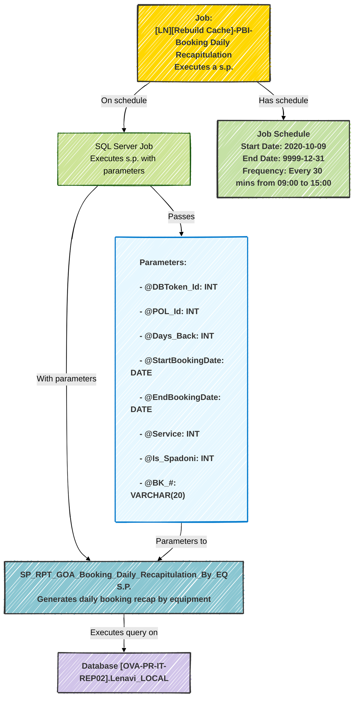

# SQL Server Job Execution Diagram

## Container Diagram for SQL Server Job

Il seguente diagramma rappresenta l'esecuzione   della stored procedure `SP_RPT_GOA_Booking_Daily_Recapitulation_By_EQ`   come step di un job SQL Server: `[LN][Rebuild Cache] - PBI - Booking Daily Recapitulation`.  Il diagramma mostra i parametri passati e la relazione tra:

1. il job  
2. lo script SQL  
3. la stored procedure nel database

