# SQL Server Stored Procedure Component Diagram

## Diagramma dei Componenti per `SP_RPT_GOA_Booking_Daily_Recapitulation_By_EQ`

Il diagramma seguente rappresenta i principali componenti, tabelle e aggiornamenti utilizzati dalla stored procedure `SP_RPT_GOA_Booking_Daily_Recapitulation_By_EQ`. Include chiamate ad altre stored procedure e funzioni, e mostra le operazioni di manipolazione dati eseguite su diverse tabelle.

```mermaid
---
config:
  theme: forest
---

flowchart TB
    %% Componenti principali
    SP["Stored Procedure:<br>SP_RPT_GOA_Booking_Daily_Recapitulation_By_EQ"]

    %% Tabelle principali
    table_ZRPT["Table:<br>LeNavi_LOCAL.dbo.<br>Z_RPT_GOA_Booking_Daily_Recapitulation"]
    table_MyZRPT["Table:<br>Interlink_Temp90<br>My_Z_RPT_GOA_Booking_Daily_Recapitulation"]
    table_DBParam["Table:<br>DB_Param"]

    %% Componenti esterni chiamati dalla stored procedure
    SP_GetDBToken["Stored Procedure:<br>SP_SQLJob_GetDBToken"]
    SP_ReleaseDBToken["Stored Procedure:<br>SP_SQLJob_ReleaseDBToken"]
    FN_IsSpadoni["Function:<br>FN_RPT_GOA_IsSpadoni"]
    FNTB_Booking["Function:<br>FNTB_Booking_BL_CSC_Daily_Bk_Recap_By_EQ"]
    FNTB_TopCargo["Function:<br>FNTB_TopCSCCargo"]
    FNTB_AssocDoc["Function:<br>FNTB_AssocDocCompany"]
    FNTB_Charge["Function:<br>FNTB_Charge"]

    %% Descrizione delle relazioni e operazioni sui componenti
    SP -->|TRUNCATE| table_ZRPT
    SP -->|DELETE| table_MyZRPT
    SP -->|INSERT INTO| table_MyZRPT
    SP -->|UPDATE| table_MyZRPT
    SP -->|INSERT INTO| table_ZRPT
    SP -->|UPDATE| table_DBParam
    
    %% Chiamate ad altre stored procedure e funzioni
    SP -->|Calls| SP_GetDBToken
    SP -->|Calls| SP_ReleaseDBToken
    SP -->|Uses| FN_IsSpadoni
    SP -->|Uses| FNTB_Booking
    SP -->|Uses| FNTB_TopCargo
    SP -->|Uses| FNTB_AssocDoc
    SP -->|Uses| FNTB_Charge

    %% Classi per i componenti visivi
    classDef tableStyle fill:#D1E8FF,stroke:#333,stroke-width:1px;
    class table_ZRPT tableStyle;
    class table_MyZRPT tableStyle;
    class table_DBParam tableStyle;

    classDef spStyle fill:#FFD700,stroke:#333,stroke-width:1px;
    class SP spStyle;
    class SP_GetDBToken spStyle;
    class SP_ReleaseDBToken spStyle;

    classDef functionStyle fill:#C6EFCE,stroke:#333,stroke-width:1px;
    class FN_IsSpadoni functionStyle;
    class FNTB_Booking functionStyle;
    class FNTB_TopCargo functionStyle;
    class FNTB_AssocDoc functionStyle;
    class FNTB_Charge functionStyle;
```

