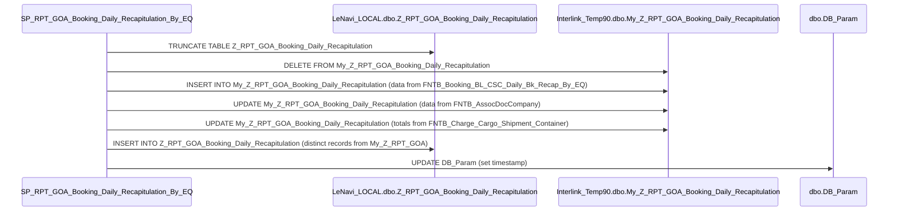

# Sequence Diagram delle Operazioni SQL

## Diagramma di Sequenza per le Operazioni di `SP_RPT_GOA_Booking_Daily_Recapitulation_By_EQ`

Il seguente diagramma mostra la sequenza di operazioni eseguite dalla stored procedure `SP_RPT_GOA_Booking_Daily_Recapitulation_By_EQ`, inclusi i `TRUNCATE`, `INSERT`, e `UPDATE` sulle tabelle principali.

