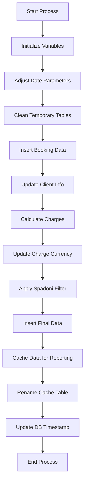

```mermaid
graph TD;
    Start["Start Process"] --> InitVars["Initialize Variables"]
    InitVars --> AdjustDates["Adjust Date Parameters"]
    AdjustDates --> CleanTables["Clean Temporary Tables"]
    CleanTables --> InsertBooking["Insert Booking Data"]
    InsertBooking --> UpdateClient["Update Client Info"]
    UpdateClient --> CalcCharges["Calculate Charges"]
    CalcCharges --> UpdateCurrency["Update Charge Currency"]
    UpdateCurrency --> FilterSpadoni["Apply Spadoni Filter"]
    FilterSpadoni --> SaveFinal["Insert Final Data"]
    SaveFinal --> CacheData["Cache Data for Reporting"]
    CacheData --> RenameCache["Rename Cache Table"]
    RenameCache --> UpdateDB["Update DB Timestamp"]
    UpdateDB --> End["End Process"]
```