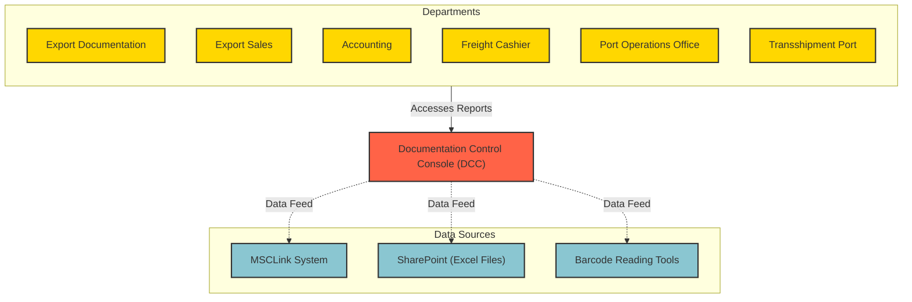

```mermaid
flowchart TB
    classDef departmentColor fill:#FFD700,stroke:#333,stroke-width:2px;
    classDef dccColor fill:#FF6347,stroke:#333,stroke-width:2px;
    classDef dataSourceColor fill:#8AC6D1,stroke:#333,stroke-width:2px;

    subgraph Departments ["Departments"]
        direction TB
        DocumentationOffice["Export Documentation"]:::departmentColor
        ExportCommercials["Export Sales"]:::departmentColor
        Accounting["Accounting"]:::departmentColor
        FreightCashier["Freight Cashier"]:::departmentColor
        PortOperationsOffice["Port Operations Office"]:::departmentColor
        TransshipmentOffice["Transshipment Port"]:::departmentColor
    end

    DCC["Documentation Control Console (DCC)"]:::dccColor

    subgraph DataSources ["Data Sources"]
        direction TB
        MSCLink["MSCLink System"]:::dataSourceColor
        SharePoint["SharePoint (Excel Files)"]:::dataSourceColor
        BarcodeReader["Barcode Reading Tools"]:::dataSourceColor
    end

    Departments -->|Accesses Reports| DCC
    DCC -.->|Data Feed| MSCLink
    DCC -.->|Data Feed| SharePoint
    DCC -.->|Data Feed| BarcodeReader
```