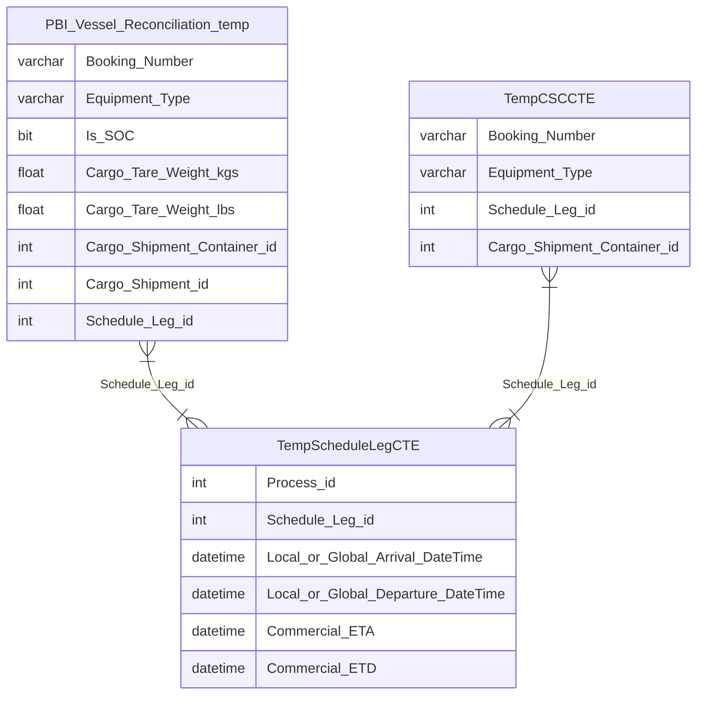

# Database Schema

Il seguente diagramma mostra le tabelle, gli indici clustered e le relazioni di join tra le tabelle.

```mermaid
erDiagram
    PBI_Vessel_Reconciliation_temp {
        varchar Booking_Number
        varchar Equipment_Type
        bit Is_SOC
        float Cargo_Tare_Weight_kgs
        float Cargo_Tare_Weight_lbs
        int Cargo_Shipment_Container_id
        int Cargo_Shipment_id
        int Schedule_Leg_id
    }

    TempScheduleLegCTE {
        int Process_id
        int Schedule_Leg_id
        datetime Local_or_Global_Arrival_DateTime
        datetime Local_or_Global_Departure_DateTime
        datetime Commercial_ETA
        datetime Commercial_ETD
    }

    TempCSCCTE {
        varchar Booking_Number
        varchar Equipment_Type
        int Schedule_Leg_id
        int Cargo_Shipment_Container_id
    }

    %% Definizione delle relazioni tra le tabelle
    PBI_Vessel_Reconciliation_temp }|--|{ TempScheduleLegCTE : "Schedule_Leg_id"
    TempCSCCTE }|--|{ TempScheduleLegCTE : "Schedule_Leg_id"
```