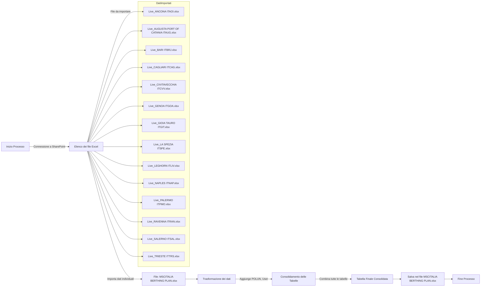

```mermaid
graph LR
    A[Inizio Processo] -->|Connessione a SharePoint| B[Elenco dei file Excel]
    B -->|Importa dati individuali| C[File: MSCITALIA BERTHING PLAN.xlsx]
    C --> D[Trasformazione dei dati]
    D -->|Aggiunge POLUN, User| E[Consolidamento delle Tabelle]
    E -->|Combina tutte le tabelle| F[Tabella Finale Consolidata]
    F --> G[Salva nel file MSCITALIA BERTHING PLAN.xlsx]
    G --> H[Fine Processo]

    %% Dettaglio dei file
    subgraph DatiImportati
        F1[Live_ANCONA ITAOI.xlsx]
        F2[Live_AUGUSTA PORT OF CATANIA ITAUG.xlsx]
        F3[Live_BARI ITBRJ.xlsx]
        F4[Live_CAGLIARI ITCAG.xlsx]
        F5[Live_CIVITAVECCHIA ITCVV.xlsx]
        F6[Live_GENOA ITGOA.xlsx]
        F7[Live_GIOIA TAURO ITGIT.xlsx]
        F8[Live_LA SPEZIA ITSPE.xlsx]
        F9[Live_LEGHORN ITLIV.xlsx]
        F10[Live_NAPLES ITNAP.xlsx]
        F11[Live_PALERMO ITPMO.xlsx]
        F12[Live_RAVENNA ITRAN.xlsx]
        F13[Live_SALERNO ITSAL.xlsx]
        F14[Live_TRIESTE ITTRS.xlsx]
    end

    B -->|File da importare| F1
    B --> F2
    B --> F3
    B --> F4
    B --> F5
    B --> F6
    B --> F7
    B --> F8
    B --> F9
    B --> F10
    B --> F11
    B --> F12
    B --> F13
    B --> F14


```