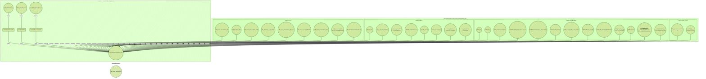

```mermaid
---
config:
  look: handDrawn
  theme: forest
---

flowchart TB

    %% --------------------------------------------
    %% Staging 1: #TempScheduleLegCTE, #TempCSCCTE, #Z_PBI_Equipment_Event
    %% --------------------------------------------

    subgraph STG[Creazione e Unione Tabelle Temporanee]
      direction TB

      A1((Z_PBI_Schedule_Leg)) --(Popola)--> Temp1(#TempScheduleLegCTE)
      A2((PBI_Bk_Bl_CSC_Export)) --(Popola)--> Temp2(#TempCSCCTE)
      A3((Z_PBI_Equipment_Event_E)) --(Popola)--> Temp3(#Z_PBI_Equipment_Event)

      Temp1 --(JOIN)--> VR_temp((PBI_Vessel_Reconciliation_temp))
      Temp2 --(JOIN)--> VR_temp
      Temp3 --(JOIN)--> VR_temp
    end

    %% --------------------------------------------
    %% Tabelle/viste secondarie che alimentano la temp
    %% --------------------------------------------

    subgraph UPD[Altre fonti/UPDATE su PBI_Vessel_Reconciliation_temp]
      direction TB

      subgraph LNAV[LeNavi_LOCAL]
        F1((PBI_Vessel_Reconciliation_FTC))
        F2((PBI_Doc_Date_Time))
        F3((PBI_Vessel_Reconciliation_VGM))
        F4((PBI_BL_List_by_freight_debtor))
        F5((PBI_Vessel_Reconciliation_SI_cache))
        F6((PBI_Charge_Lenavi_MEDLOG))
        F7((PBI_Vessel_Reconciliation_Seals))
        F8((PBI_Intermodal_CSC<br/>PBI_DCC_Intermodal_cache))
        F9((PBI_Vessel_Reconciliation_MFTC))
      end

      subgraph M90[Interlink_Main90]
        M1((Bill_Of_Lading))
        M2((Cargo_Shipment_Container))
        M3((Equipment_Event/Detail<br/>+ GISTerminal, etc.))
        M4((BOLREP_Header/Company))
        M5((Web_BL_Journal))
        M6((Service_Contract_Type))
        M7((Casp_File_7 / Casp_File_7_Container))
        M8((Doc_Date_Time / GISCurrency))
      end

      subgraph DFD[Interlink_DFeed90.dfeed]
        D1((FNTB_Port))
        D2((FNTB_Depot))
        D3((FNTB_Container_Last_Event))
        D4((OVAVREC_FNTB_CSC_Hazardous_Info))
        D5((FNTB_AssocDocCompany_BusinessEntity))
        D6((FNTB_Is_UPC_Contract))
        D7((FNTB_Booking_DG_Accept_Finalize))
        D8((FNTB_HSCodes_By_CSC))
        D9((FNTB_EDI_Extended_ByTableCode))
        D10((FNTB_Schedule_Leg_<br/>TS_ETA_ETD_Cache))
        D11((FNTB_SecUser))
        D12((FN_AlphaNumOnly, FNTB_ECR_DaGaLlie,<br/>FNTB_Equipment_Cycle_Sub,...))
        D13((OVAVREC_FNTB_<br/>Get_COPRAR_Info_Main))
      end

      subgraph LNLOC[Altre in LeNavi_LOCAL]
        X1((PBI_Vessel_Reconciliation_<br/>SI))
        X2((FNTB_BL_<br/>CLASSIFICATIONS))
      end

      %% Tutte queste alimentano PBI_Vessel_Reconciliation_temp via UPDATE
      F1 --(UPDATE)--> VR_temp
      F2 --(UPDATE)--> VR_temp
      F3 --(UPDATE)--> VR_temp
      F4 --(UPDATE)--> VR_temp
      F5 --(UPDATE)--> VR_temp
      F6 --(UPDATE)--> VR_temp
      F7 --(UPDATE)--> VR_temp
      F8 --(UPDATE)--> VR_temp
      F9 --(UPDATE)--> VR_temp

      M1 --(UPDATE)--> VR_temp
      M2 --(UPDATE)--> VR_temp
      M3 --(UPDATE)--> VR_temp
      M4 --(UPDATE)--> VR_temp
      M5 --(UPDATE)--> VR_temp
      M6 --(UPDATE)--> VR_temp
      M7 --(UPDATE)--> VR_temp
      M8 --(UPDATE)--> VR_temp

      D1 --(UPDATE)--> VR_temp
      D2 --(UPDATE)--> VR_temp
      D3 --(UPDATE)--> VR_temp
      D4 --(UPDATE)--> VR_temp
      D5 --(UPDATE)--> VR_temp
      D6 --(UPDATE)--> VR_temp
      D7 --(UPDATE)--> VR_temp
      D8 --(UPDATE)--> VR_temp
      D9 --(UPDATE)--> VR_temp
      D10 --(UPDATE)--> VR_temp
      D11 --(UPDATE)--> VR_temp
      D12 --(UPDATE)--> VR_temp
      D13 --(UPDATE)--> VR_temp

      X1 --(UPDATE)--> VR_temp
      X2 --(UPDATE)--> VR_temp

    end

    %% --------------------------------------------
    %% Tabella finale: rename di PBI_Vessel_Reconciliation_temp
    %% --------------------------------------------

    VR_temp --(RENAME/COMMIT)--> VR((PBI_Vessel_Reconciliation))
```