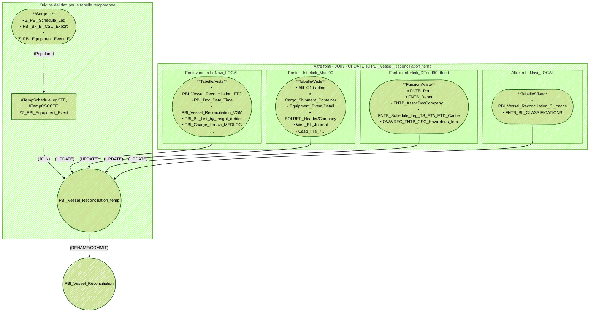

```mermaid
---
config:
  look: handDrawn
  theme: forest
---
flowchart TB

%% --------------------------------------------
%% BLOCCO 1: TABELLE/OGGETTI DI ORIGINE PER #TEMP
%% --------------------------------------------

subgraph SD[Origine dei dati per le tabelle temporanee]
  direction TB

  noteSources([**Sorgenti**<br/>• Z_PBI_Schedule_Leg<br/>• PBI_Bk_Bl_CSC_Export<br/>• Z_PBI_Equipment_Event_E])
  noteSources --(Popolano)--> tempStg[#TempScheduleLegCTE,<br/>#TempCSCCTE,<br/>#Z_PBI_Equipment_Event]

  tempStg --(JOIN)--> VR_temp((PBI_Vessel_Reconciliation_temp))
end

%% --------------------------------------------
%% BLOCCO 2: ALTRE FONTI/UPDATE SU VR_temp
%% --------------------------------------------

subgraph UPD[Altre fonti  - JOIN - UPDATE su PBI_Vessel_Reconciliation_temp]
  direction TB

  subgraph LNAV[Fonti varie in LeNavi_LOCAL]
    direction TB
    LNAVList([**Tabelle/Viste**<br/>• PBI_Vessel_Reconciliation_FTC<br/>• PBI_Doc_Date_Time<br/>• PBI_Vessel_Reconciliation_VGM<br/>• PBI_BL_List_by_freight_debtor<br/>• PBI_Charge_Lenavi_MEDLOG<br/>…])
  end
  LNAVList --(UPDATE)--> VR_temp

  subgraph M90[Fonti in Interlink_Main90]
    direction TB
    M90List([**Tabelle/Viste**<br/>• Bill_Of_Lading<br/>• Cargo_Shipment_Container<br/>• Equipment_Event/Detail<br/>• BOLREP_Header/Company<br/>• Web_BL_Journal<br/>• Casp_File_7…])
  end
  M90List --(UPDATE)--> VR_temp

  subgraph DFD[Fonti in Interlink_DFeed90.dfeed]
    direction TB
    DFDList([**Funzioni/Viste**<br/>• FNTB_Port<br/>• FNTB_Depot<br/>• FNTB_AssocDocCompany…<br/>• FNTB_Schedule_Leg_TS_ETA_ETD_Cache<br/>• OVAVREC_FNTB_CSC_Hazardous_Info<br/>…])
  end
  DFDList --(UPDATE)--> VR_temp

  subgraph LNLOC[Altre in LeNavi_LOCAL]
    direction TB
    LNLOCList([**Tabelle/Viste**<br/>• PBI_Vessel_Reconciliation_SI_cache<br/>• FNTB_BL_CLASSIFICATIONS<br/>…])
  end
  LNLOCList --(UPDATE)--> VR_temp

end

%% --------------------------------------------
%% BLOCCO 3: TABELLA FINALE
%% --------------------------------------------

VR_temp --(RENAME/COMMIT)--> VR((PBI_Vessel_Reconciliation))

```