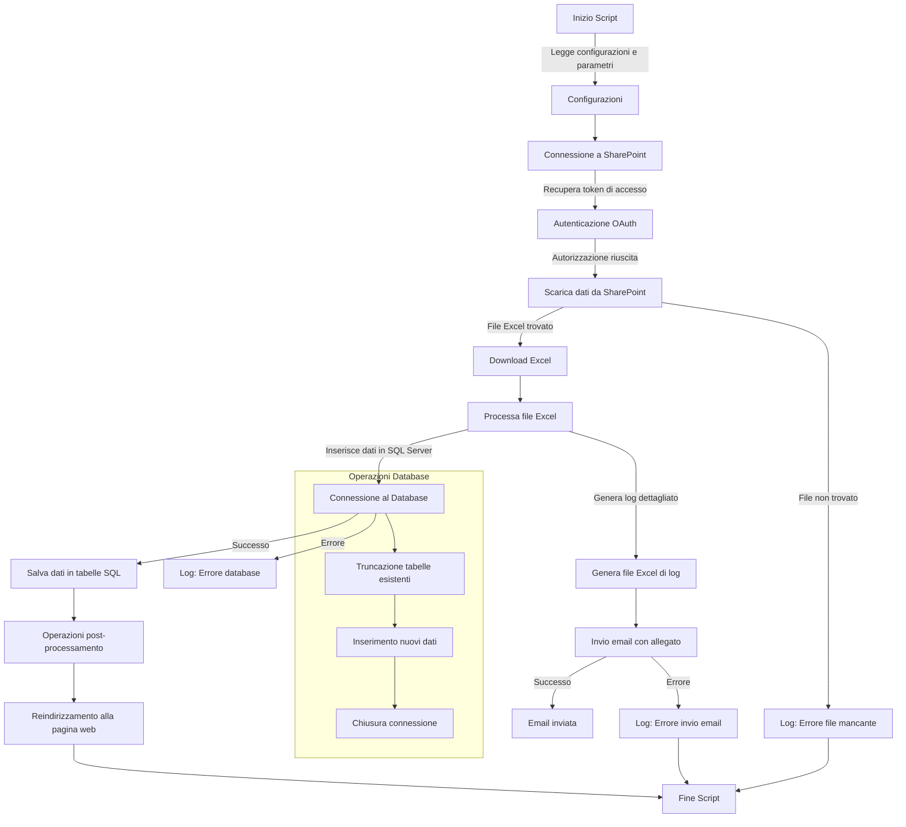

```mermaid
graph TD
    A[Inizio Script] -->|Legge configurazioni e parametri| B[Configurazioni]
    B --> C[Connessione a SharePoint]
    C -->|Recupera token di accesso| D[Autenticazione OAuth]
    D -->|Autorizzazione riuscita| E[Scarica dati da SharePoint]
    E -->|File Excel trovato| F[Download Excel]
    E -->|File non trovato| G[Log: Errore file mancante]

    F --> H[Processa file Excel]
    H -->|Inserisce dati in SQL Server| I[Connessione al Database]
    I -->|Successo| J[Salva dati in tabelle SQL]
    I -->|Errore| K[Log: Errore database]

    H -->|Genera log dettagliato| L[Genera file Excel di log]
    L --> M[Invio email con allegato]
    M -->|Successo| N[Email inviata]
    M -->|Errore| O[Log: Errore invio email]

    J --> P[Operazioni post-processamento]
    P --> Q[Reindirizzamento alla pagina web]
    Q --> R[Fine Script]

    G --> R
    O --> R

    %% Subprocesso per gestione tabelle
    subgraph DatabaseOperations [Operazioni Database]
        direction TB
        I --> T1[Truncazione tabelle esistenti]
        T1 --> T2[Inserimento nuovi dati]
        T2 --> T3[Chiusura connessione]
    end
```