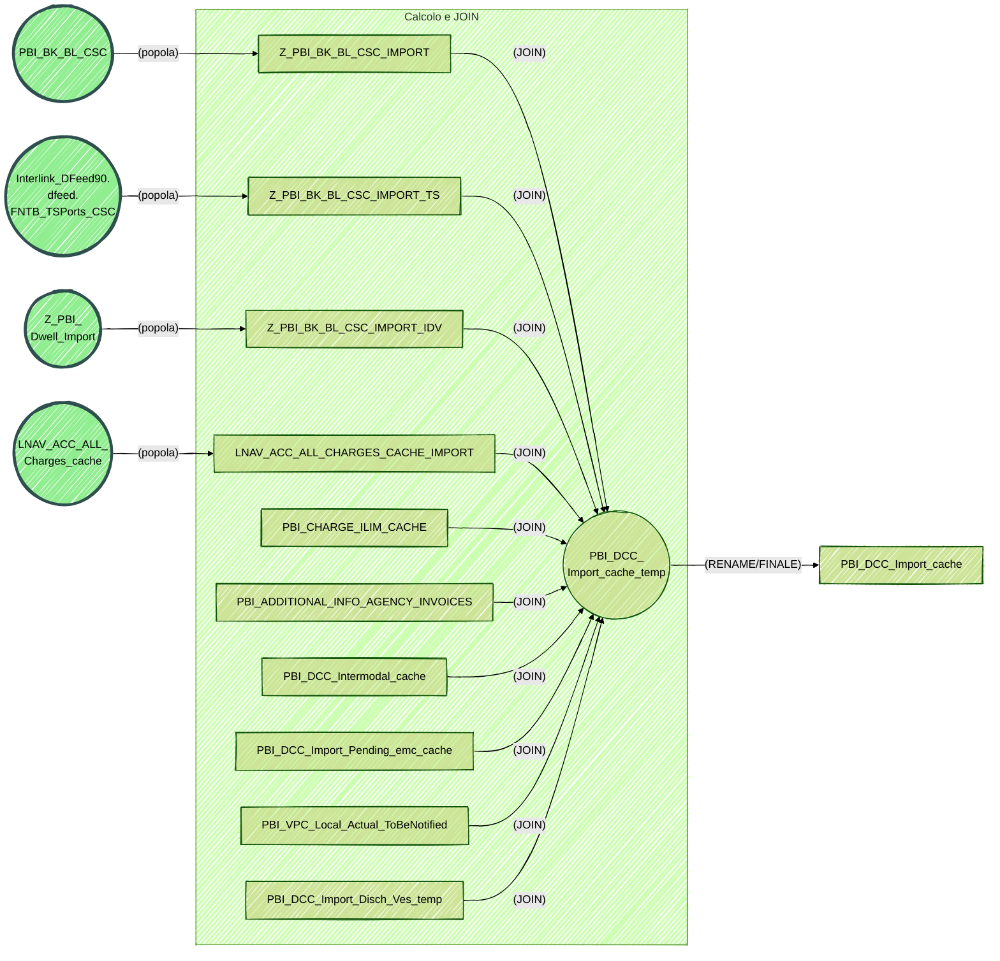

```mermaid
---
config:
  look: handDrawn
  theme: forest
---
flowchart LR


    %% Definizione di una classe "verde" con sfondo + bordo
    classDef verde fill:#90EE90,stroke:#2F4F4F,stroke-width:4px


    A((PBI_BK_BL_CSC)) --(popola)--> Z_PBI_BK_BL_CSC_IMPORT
    A1((LNAV_ACC_ALL_<br/>Charges_cache)) --(popola)--> LNAV_ACC_ALL_CHARGES_CACHE_IMPORT
    A2((Interlink_DFeed90.<br/>dfeed.<br/>FNTB_TSPorts_CSC)) --(popola)--> Z_PBI_BK_BL_CSC_IMPORT_TS
    A3((Z_PBI_<br/>Dwell_Import)) --(popola)--> Z_PBI_BK_BL_CSC_IMPORT_IDV

    subgraph Calcolo e JOIN
      Z_PBI_BK_BL_CSC_IMPORT --(JOIN)--> T((PBI_DCC_<br/>Import_cache_temp))
      Z_PBI_BK_BL_CSC_IMPORT_TS --(JOIN)--> T
      Z_PBI_BK_BL_CSC_IMPORT_IDV --(JOIN)--> T
      LNAV_ACC_ALL_CHARGES_CACHE_IMPORT --(JOIN)--> T
      PBI_CHARGE_ILIM_CACHE --(JOIN)--> T
      PBI_ADDITIONAL_INFO_AGENCY_INVOICES --(JOIN)--> T
      PBI_DCC_Intermodal_cache --(JOIN)--> T
      PBI_DCC_Import_Pending_emc_cache --(JOIN)--> T
      PBI_VPC_Local_Actual_ToBeNotified --(JOIN)--> T
      PBI_DCC_Import_Disch_Ves_temp --(JOIN)--> T
    end

    T --(RENAME/FINALE)--> PBI_DCC_Import_cache


    %% Assegnazione della classe "verde" ai 4 nodi
    class A,A1,A2,A3 verde


```