# SQL Server Jobs: Refresh 'DCC Logistic History'

Questo diagramma descrive il flusso dei jobs SQL Server schedulati tramite SQL Server Agent, che eseguono una serie di stored procedure e termina con l'aggiornamento di un cubo SSAS.

## Flusso del Job SQL Server

```mermaid
%%{init: {'theme': 'base', 'themeVariables': {
  'primaryColor': '#FFD700', /* Gold for main nodes */
  'primaryBorderColor': '#000000', /* Black border */
  'primaryTextColor': '#000000', /* Black text */
  'secondaryColor': '#87CEEB', /* Light blue for secondary nodes */
  'secondaryBorderColor': '#4682B4', /* Steel blue border */
  'secondaryTextColor': '#FFFFFF', /* White text */
  'tertiaryColor': '#FF6347', /* Tomato for tertiary nodes */
  'tertiaryTextColor': '#FFFFFF', /* White text */
  'lineColor': '#1DA089', /* Teal lines */
  'arrowheadColor': '#1DA089', /* Matching arrowheads */
  'fontSize': '16px', /* General font size */
  'fontFamily': 'Arial, sans-serif', /* General font family */
  'labelFontSize': '14px', /* Edge label font size */
  'background': '#F5F5F5', /* Light gray background */
  'clusterBkg': '#FFF8DC', /* Cornsilk background for clusters */
  'clusterBorderColor': '#8B4513' /* Saddle brown border for clusters */
}}}%%
flowchart LR
    A[Sequenza Jobs DCC Logistico Storico] --> B1[Job: PBI - Trasporti - 01 - Eq. Cycle]
    B1 -->|Equipment Cycle| H1[SP_PBI_Equipment_Cycle_Sub]

    A --> B2[Job: PBI - Trasporti - 02 - Eq. Events - Full]
    B2 -->|Eq. FULL Eventi: Import/Export| I1[SP_PBI_Equipment_Event_Full]

    A --> B3[Job: PBI - Trasporti - 03 - Eq. Events - CODECO - Rail_Truck]
    B3 -->|Lettura CODECO| J1[SP_PBI_CODECO_CACHE]

    A --> B4[Job: PBI - Trasporti - 04 - History - Full + Empty]
    B4 -->|Container INFO| K1[SP_PBI_Build_Agency_CSC_Cache]
    B4 -->|Sorgente Dati DCC Logistico: Eq. FULL| K2[SP_PBI_DCC_ITALY_H]
    B4 -->|Eq. EMPTY Eventi| K3[SP_PBI_Equipment_Event_Empty]
    B4 -->|Sorgente Dati DCC Logistico: Eq. EMPTY| K4[SP_PBI_DCC_ITALY_H_EM]
    K2 -->|solo FULL| T1[PBI_DCC_H_cache]
    K4 -->|solo EMPTY| T2[PBI_DCC_H_EM_cache]

    B4 -->|Sorgente Dati DCC Logistico: Eq. FULL + EMPTY| K5[SP_PBI_DCC_H_ALL]
    T1 -->|solo FULL| V1[PBI_DCC_H_ALL_cache_vw]
    T2 -->|solo FULL| V1[PBI_DCC_H_ALL_cache_vw]
    V1 -->  K5[SP_PBI_DCC_H_ALL]

    K5 -->|Tutti Equipment| T3[PBI_DCC_H_ALL_cache]
    
    %% SSAS connection added as the last link explicitly
    B4 -->|SSAS| C1[Cubo: DCC_ITALY]

    %% Stili personalizzati:
    style B1 fill:#E4CC37,stroke:#000,stroke-width:2px
    style B2 fill:#E4CC37,stroke:#000,stroke-width:2px
    style B3 fill:#E4CC37,stroke:#000,stroke-width:2px
    style B4 fill:#E4CC37,stroke:#000,stroke-width:2px
    style H1 fill:#F2C14E,stroke:#000,stroke-width:2px

    style I1 fill:#F2C14E,stroke:#000,stroke-width:2px

    style J1 fill:#F2C14E,stroke:#000,stroke-width:2px

    style K1 fill:#F2C14E,stroke:#000,stroke-width:2px
    style K2 fill:#F2C14E,stroke:#000,stroke-width:2px
    style K3 fill:#F2C14E,stroke:#000,stroke-width:2px
    style K4 fill:#F2C14E,stroke:#000,stroke-width:2px
    style K5 fill:#F2C14E,stroke:#000,stroke-width:2px
    style V1 fill:#1DA089,stroke:#000,stroke-width:2px
    style C1 fill:#24647F,stroke:#000,stroke-width:2px,color:white
    style T1 fill:#EB5160,stroke:#000,stroke-width:2px,color:white
    style T2 fill:#EB5160,stroke:#000,stroke-width:2px,color:white
    style T3 fill:#EB5160,stroke:#000,stroke-width:2px,color:white


    %% Customizing the labels' background
    linkStyle 0 stroke:#000,stroke-width:1px,fill:#d3d3d3,color:#000
    linkStyle 1 stroke:#000,stroke-width:1px,fill:#d3d3d3,color:#000
    linkStyle 2 stroke:#000,stroke-width:1px,fill:#d3d3d3,color:#000
    linkStyle 3 stroke:#000,stroke-width:1px,fill:#d3d3d3,color:#000
```

