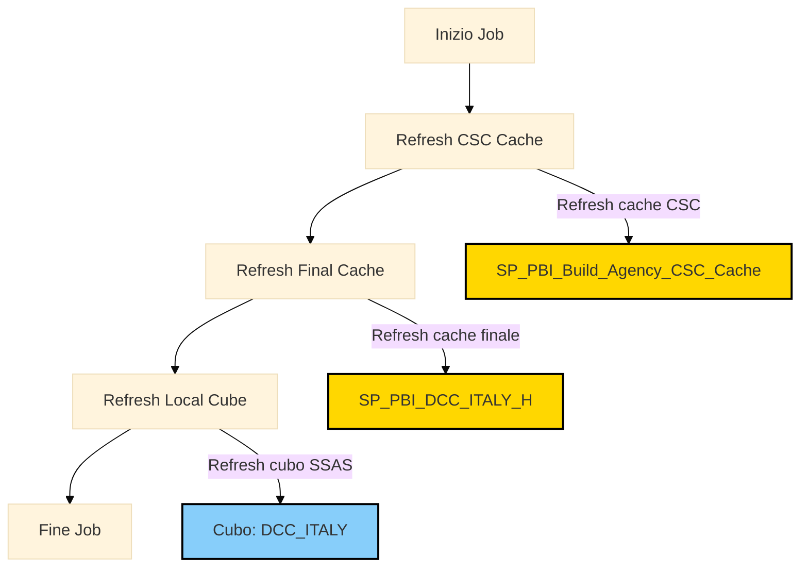

# Documentazione del Job SQL Server: [LN][Rebuild Cache] - PBI - Trasporti - History

Questo documento descrive il flusso del job SQL Server schedulato tramite SQL Server Agent, che esegue una serie di stored procedure e termina con l'aggiornamento di un cubo SSAS.

## Flusso del Job SQL Server

