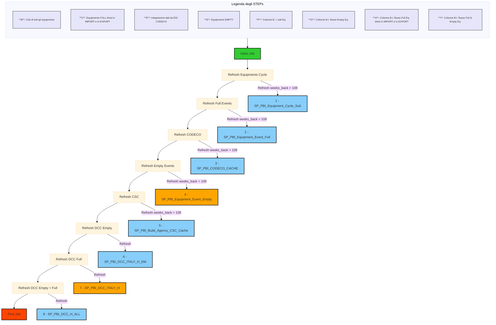
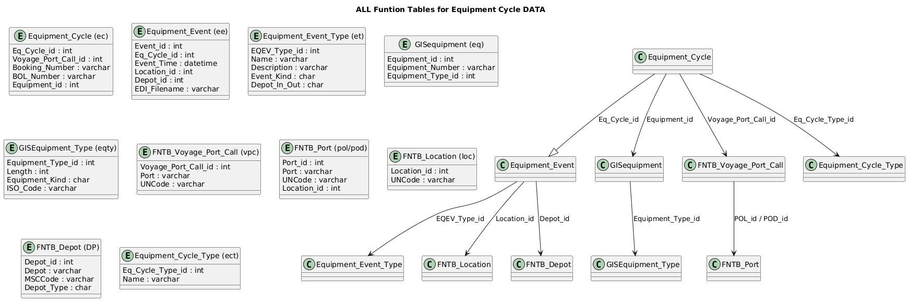
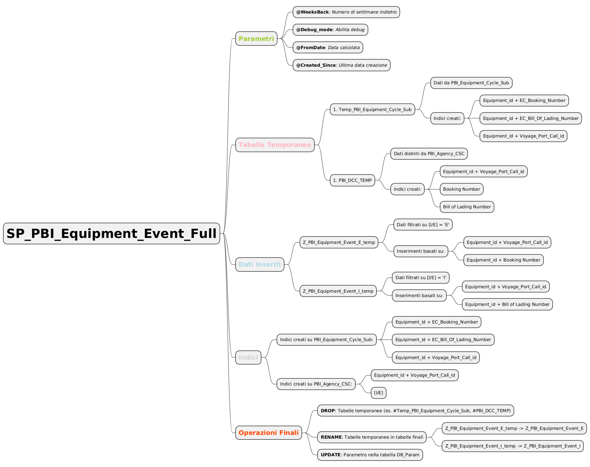

## Flusso del Job SQL Server

```mermaid
%%{init: {'theme': 'base', 'themeVariables': {'handdraw': true}}}%%
flowchart TB  
    %% Legenda: Posizionata in alto a sinistra
    subgraph Legenda ["Legenda degli STEPs"]
        direction TB  %% Forza la disposizione verticale
        LB["**B**: Cicli di tutti gli equipments"]:::legendStyle
        LC["**C**: Equipments FULL divisi in IMPORT e in EXPORT"]:::legendStyle
        LD["**D**: Integrazione dati da EDI CODECO"]:::legendStyle
        LE["**E**: Equipments EMPTY"]:::legendStyle
        LF["**F**: Colonne B. I. tutti Eq."]:::legendStyle
        LG["**G**: Colonne B.I. flusso Empty Eq."]:::legendStyle
        LH["**H**: Colonne B.I. flusso Full Eq. divisi in IMPORT e in EXPORT"]:::legendStyle
        LI["**I**: Colonne B.I. flusso Full & Empty Eq."]:::legendStyle
    end
    Legenda --> A

    %% Flusso principale:
    A[Inizio Job] --> B[Refresh Equipments Cycle]
    B --> C[Refresh Full Events]
    C --> D[Refresh CODECO]
    D --> E[Refresh Empty Events]
    E --> F[Refresh CSC]
    F --> G[Refresh DCC Empty]
    G --> H[Refresh DCC Full]
    H --> I[Refresh DCC Empty + Full]
    I --> L[Fine Job]

    %% Descrizione dei passi:
    B -->|Refresh weeks_back = 108| P[1 - SP_PBI_Equipment_Cycle_Sub]
    C -->|Refresh weeks_back = 108| Q[2 - SP_PBI_Equipment_Event_Full]
    D -->|Refresh weeks_back = 108| R[3 - SP_PBI_CODECO_CACHE]
    E -->|Refresh weeks_back = 108| S[4 - SP_PBI_Equipment_Event_Empty]
    F -->|Refresh weeks_back = 108| T[5 - SP_PBI_Build_Agency_CSC_Cache]
    G -->|Refresh| U[6 - SP_PBI_DCC_ITALY_H_EM]
    H -->|Refresh| V[7 - SP_PBI_DCC_ITALY_H]
    I -->|Refresh| Z[8 - SP_PBI_DCC_H_ALL]

    %% Stili personalizzati:
    style A fill:#32CD32,stroke:#000,stroke-width:2px
    style L fill:#FF4500,stroke:#000,stroke-width:2px
    style P fill:#87CEFA,stroke:#000,stroke-width:2px
    style Q fill:#87CEFA,stroke:#000,stroke-width:2px
    style R fill:#87CEFA,stroke:#000,stroke-width:2px
    style S fill:#FFA500,stroke:#000,stroke-width:2px
    style T fill:#87CEFA,stroke:#000,stroke-width:2px
    style U fill:#87CEFA,stroke:#000,stroke-width:2px
    style V fill:#FFA500,stroke:#000,stroke-width:2px
    style Z fill:#87CEFA,stroke:#000,stroke-width:2px

    %% Stili per la legenda:
    classDef legendStyle fill:#E6E6FA,stroke:#000,stroke-width:1px,font-size:12px,padding:5px

```
## 1. Flusso dati Equipment Cycle

## 2. Flusso dati Eventi Export & Import

