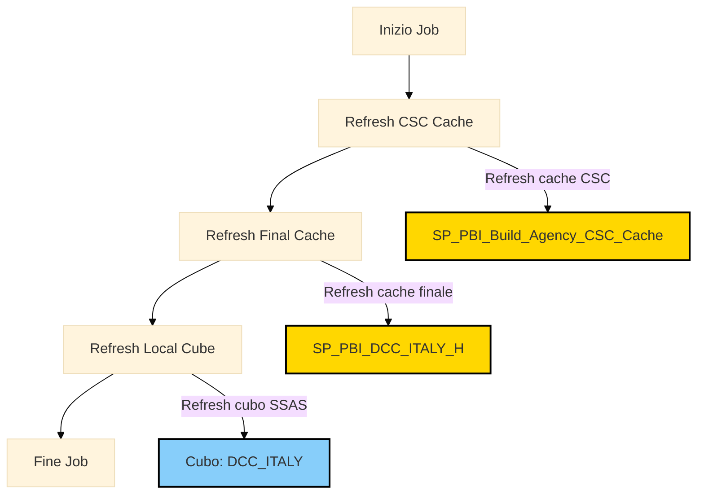

## Flusso del Job SQL Server

```mermaid
%%{init: {'theme': 'base', 'themeVariables': {'handdraw': true}}}%%
flowchart TB
    A[Inizio Job] --> C[Refresh CSC Cache]
    C --> D[Refresh Final Cache]
    D --> E[Refresh Local Cube]
    E --> F[Fine Job]

    %% Descrizione dei passi:

    C -->|Refresh cache CSC| H[SP_PBI_Build_Agency_CSC_Cache]
    D -->|Refresh cache finale| I[SP_PBI_DCC_ITALY_H]
    E -->|Refresh cubo SSAS| J[Cubo: DCC_ITALY]

    %% Stili personalizzati:
    style H fill:#FFD700,stroke:#000,stroke-width:2px
    style I fill:#FFD700,stroke:#000,stroke-width:2px
    style J fill:#87CEFA,stroke:#000,stroke-width:2px
```
## Flusso dati Equipment Cycle

