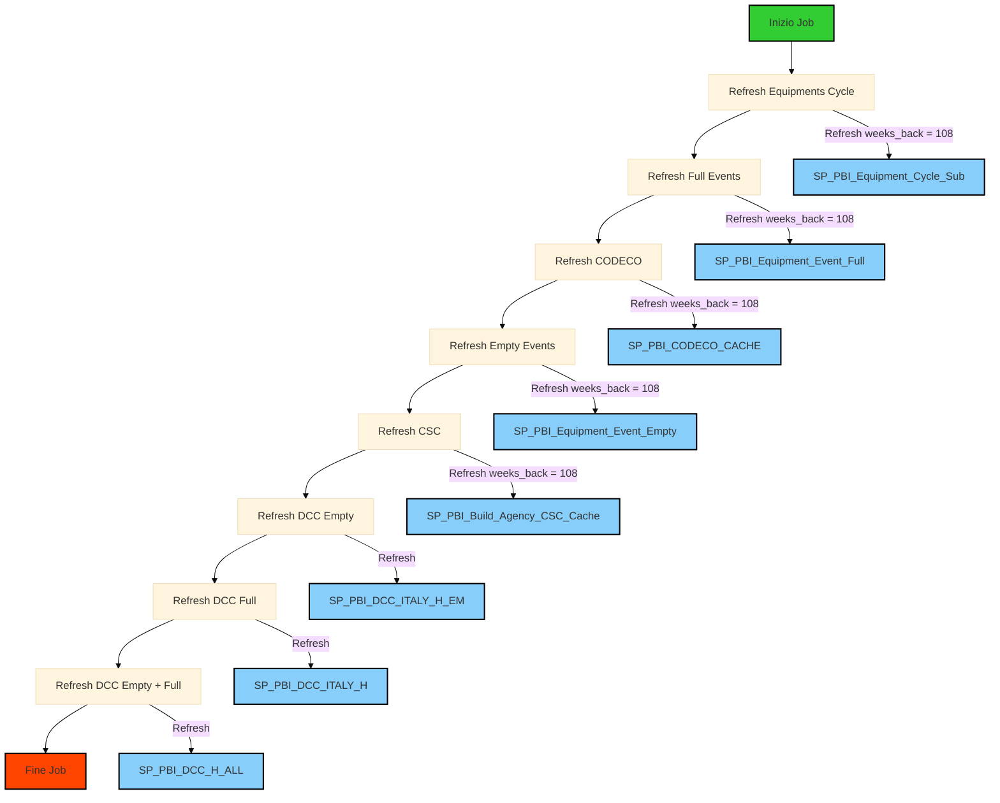
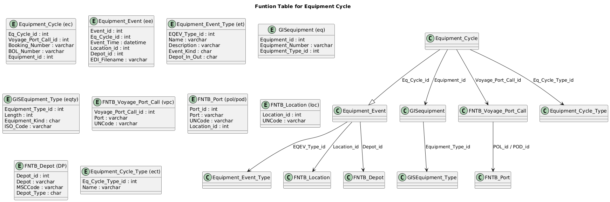

## Flusso del Job SQL Server

```mermaid
%%{init: {'theme': 'base', 'themeVariables': {'handdraw': true}}}%%
flowchart TB
    A[Inizio Job] --> B[Refresh Equipments Cycle]
    B --> C[Refresh Full Events]
    C --> D[Refresh CODECO]
    D --> E[Refresh Empty Events]
    E --> F[Refresh CSC]
    F --> G[Refresh DCC Empty]
    G --> H[Refresh DCC Full]
    H --> I[Refresh DCC Empty + Full]
    I --> L[Fine Job]

    %% Descrizione dei passi:

    B -->|Refresh weeks_back = 108| P[SP_PBI_Equipment_Cycle_Sub]
    C -->|Refresh weeks_back = 108| Q[SP_PBI_Equipment_Event_Full]
    D -->|Refresh weeks_back = 108| R[SP_PBI_CODECO_CACHE]
    E -->|Refresh weeks_back = 108| S[SP_PBI_Equipment_Event_Empty]
    F -->|Refresh weeks_back = 108| T[SP_PBI_Build_Agency_CSC_Cache]
    G -->|Refresh| U[SP_PBI_DCC_ITALY_H_EM]
    H -->|Refresh| V[SP_PBI_DCC_ITALY_H]
    I -->|Refresh| Z[SP_PBI_DCC_H_ALL]

    %% Stili personalizzati:
    style A fill:#32CD32,stroke:#000,stroke-width:2px
    style L fill:#FF4500,stroke:#000,stroke-width:2px
    style P fill:#87CEFA,stroke:#000,stroke-width:2px
    style Q fill:#87CEFA,stroke:#000,stroke-width:2px
    style R fill:#87CEFA,stroke:#000,stroke-width:2px
    style S fill:#87CEFA,stroke:#000,stroke-width:2px
    style T fill:#87CEFA,stroke:#000,stroke-width:2px
    style U fill:#87CEFA,stroke:#000,stroke-width:2px
    style V fill:#87CEFA,stroke:#000,stroke-width:2px
    style Z fill:#87CEFA,stroke:#000,stroke-width:2px
```
## Flusso dati Equipment Cycle

