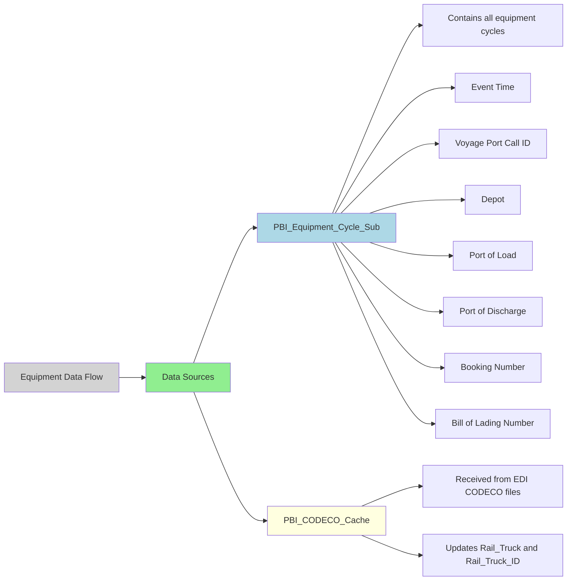

```mermaid


graph LR
  A[Equipment Data Flow]
  B[Data Sources]
  A --> B
  B --> C[PBI_Equipment_Cycle_Sub]
  C --> D["Contains all equipment cycles"]
  C --> E["Event Time"]
  C --> F["Voyage Port Call ID"]
  C --> G["Depot"]
  C --> H["Port of Load"]
  C --> I["Port of Discharge"]
  C --> J["Booking Number"]
  C --> K["Bill of Lading Number"]
  B --> L[PBI_CODECO_Cache]
  L --> M["Received from EDI CODECO files"]
  L --> N["Updates Rail_Truck and Rail_Truck_ID"]
  style B fill:lightgreen
  style C fill:lightblue
  style L fill:lightyellow
  style A fill:lightgray

```