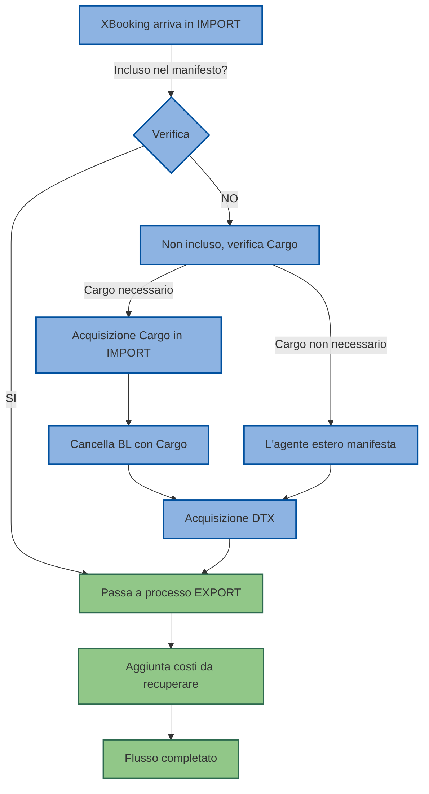

## Flusso dei XBooking - Agenti Esteri

```mermaid
graph TD;
    A["XBooking arriva in IMPORT"]:::import -->|Incluso nel manifesto?| B{Verifica}:::import;
    B -- SI --> L["Passa a processo EXPORT"]:::export;
    B -- NO --> C["Non incluso, verifica Cargo"]:::import;
    
    C -- Cargo necessario --> E["Acquisizione Cargo in IMPORT"]:::import --> H["Cancella BL con Cargo"]:::import --> I["Acquisizione DTX"]:::import;
    C -- Cargo non necessario --> G["L'agente estero manifesta"]:::import --> I;
    
    I --> L;
    L --> J["Aggiunta costi da recuperare"]:::export --> K["Flusso completato"]:::export;

    classDef import fill:#8db3e2,stroke:#00509e,stroke-width:2px;
    classDef export fill:#91c788,stroke:#2d6a4f,stroke-width:2px;


```