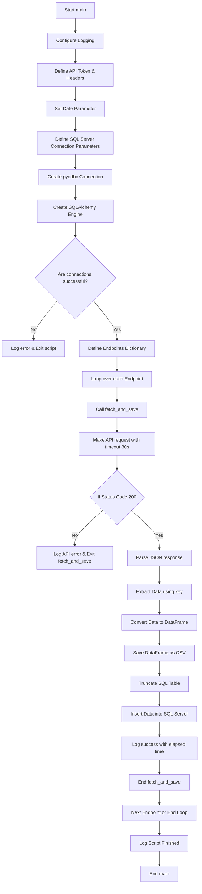

# Project Flowchart

Below is the flowchart for the main steps in our data processing script:

```mermaid
flowchart TD
    A[Start main] --> B[Configure Logging]
    B --> C[Define API Token & Headers]
    C --> D[Set Date Parameter]
    D --> E[Define SQL Server Connection Parameters]
    E --> F[Create pyodbc Connection]
    F --> G[Create SQLAlchemy Engine]
    G --> H{Are connections successful?}
    H -- No --> Z[Log error & Exit script]
    H -- Yes --> I[Define Endpoints Dictionary]
    I --> J[Loop over each Endpoint]
    J --> K[Call fetch_and_save]
    K --> L[Make API request with timeout 30s]
    L --> M{If Status Code 200}
    M -- No --> N[Log API error & Exit fetch_and_save]
    M -- Yes --> O[Parse JSON response]
    O --> P[Extract Data using key]
    P --> Q[Convert Data to DataFrame]
    Q --> R[Save DataFrame as CSV]
    R --> S[Truncate SQL Table]
    S --> T[Insert Data into SQL Server]
    T --> U[Log success with elapsed time]
    U --> V[End fetch_and_save]
    V --> W[Next Endpoint or End Loop]
    W --> X[Log Script Finished]
    X --> AA[End main]
```
