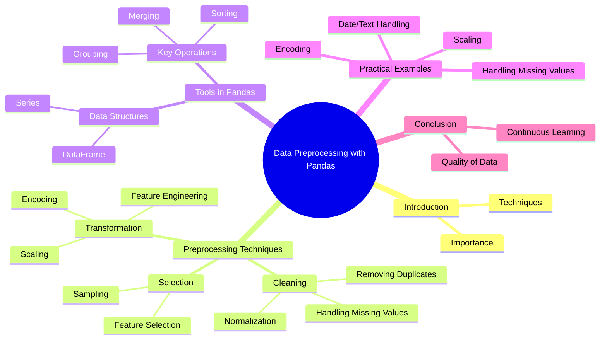

# Data Preprocessing with Pandas

```mermaid
mindmap
  root((Data Preprocessing with Pandas))
    Introduction
      Importance
      Techniques
    Preprocessing Techniques
      Cleaning
        Removing Duplicates
        Handling Missing Values
        Normalization
      Transformation
        Scaling
        Encoding
        Feature Engineering
      Selection
        Feature Selection
        Sampling
    Tools in Pandas
      Data Structures
        Series
        DataFrame
      Key Operations
        Merging
        Grouping
        Sorting
    Practical Examples
      Handling Missing Values
      Scaling
      Encoding
      Date/Text Handling
    Conclusion
      Quality of Data
      Continuous Learning
```