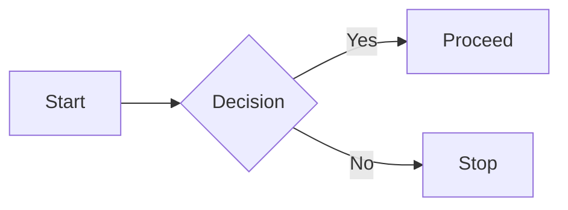

# Project Diagrams

Click on a diagram below to jump to it:

- [Diagram 1: Workflow](#diagram-1-workflow)
- [Diagram 2: Data Flow](#diagram-2-data-flow)
- [Diagram 3: System Architecture](#diagram-3-system-architecture)

---

## Diagram 1: Workflow


[Back to top](#project-diagrams)

## Diagram 2: Workflow

```
flowchart TD
    A -->|Data| B
    B --> C
    C --> D

```
[Back to top](#project-diagrams)

## Diagram 3: Workflow

```
flowchart LR
    Client --> Server
    Server --> Database
    Database --> Backup

```
[Back to top](#project-diagrams)
