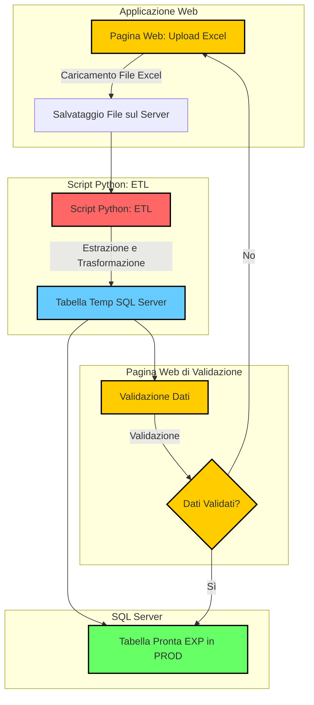

```mermaid
flowchart TB


    subgraph AppWeb["Applicazione Web"]
        A[Pagina Web: Upload Excel] -->|Caricamento File Excel| B[Salvataggio File sul Server]
    end

    subgraph ScriptPython["Script Python: ETL"]
        B --> C[Script Python: ETL]
        C -->|Estrazione e Trasformazione| D[Tabella Temp SQL Server]
    end

    subgraph SQLServer["SQL Server"]
        D --> E[Tabella Pronta EXP in PROD]
    end

    subgraph Validazione["Pagina Web di Validazione"]
        D --> F[Validazione Dati]
        F -->|Validazione| G{Dati Validati?}
        G -->|Sì| E
        G -->|No| A
    end

    style A fill:#ffcc00,stroke:#000,stroke-width:2px
    style C fill:#ff6666,stroke:#000,stroke-width:2px
    style D fill:#66ccff,stroke:#000,stroke-width:2px
    style E fill:#66ff66,stroke:#000,stroke-width:2px
    style F fill:#ffcc00,stroke:#000,stroke-width:2px
    style G fill:#ffcc00,stroke:#000,stroke-width:2px,shape:diamond


```