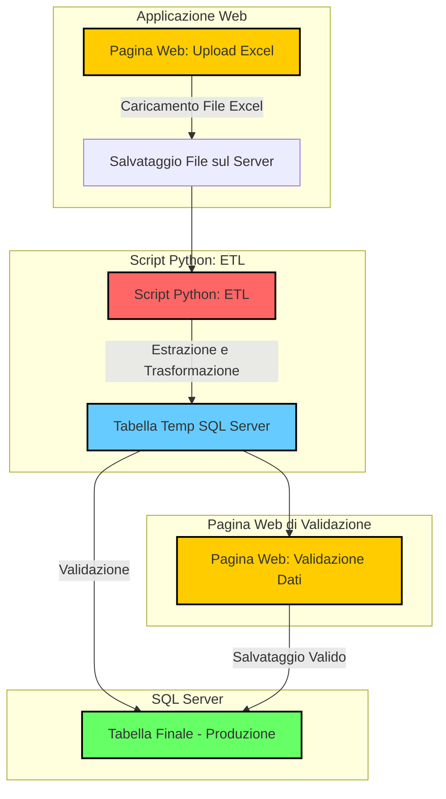

```mermaid
flowchart TD
    subgraph AppWeb["Applicazione Web"]
        A[Pagina Web: Upload Excel] -->|Caricamento File Excel| B[Salvataggio File sul Server]
    end

    subgraph ScriptPython["Script Python: ETL"]
        B --> C[Script Python: ETL]
        C -->|Estrazione e Trasformazione| D[Tabella Temp SQL Server]
    end

    subgraph SQLServer["SQL Server"]
        D -->|Validazione| E[Tabella Finale - Produzione]
    end

    subgraph Validazione["Pagina Web di Validazione"]
        D --> F[Pagina Web: Validazione Dati]
        F -->|Salvataggio Valido| E
    end

    style A fill:#ffcc00,stroke:#000,stroke-width:2px
    style C fill:#ff6666,stroke:#000,stroke-width:2px
    style D fill:#66ccff,stroke:#000,stroke-width:2px
    style E fill:#66ff66,stroke:#000,stroke-width:2px
    style F fill:#ffcc00,stroke:#000,stroke-width:2px
```