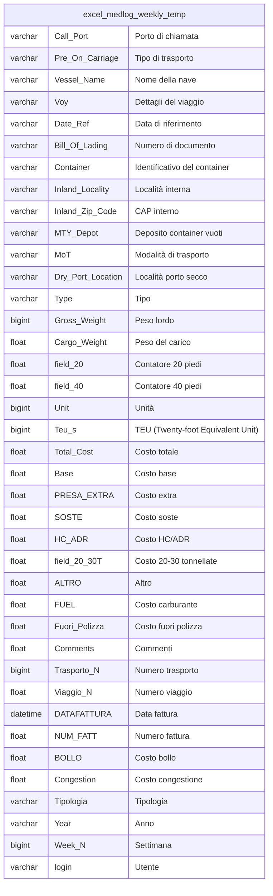

```mermaid
erDiagram
    excel_medlog_weekly_temp {
        varchar Call_Port "Porto di chiamata"
        varchar Pre_On_Carriage "Tipo di trasporto"
        varchar Vessel_Name "Nome della nave"
        varchar Voy "Dettagli del viaggio"
        varchar Date_Ref "Data di riferimento"
        varchar Bill_Of_Lading "Numero di documento"
        varchar Container "Identificativo del container"
        varchar Inland_Locality "Località interna"
        varchar Inland_Zip_Code "CAP interno"
        varchar MTY_Depot "Deposito container vuoti"
        varchar MoT "Modalità di trasporto"
        varchar Dry_Port_Location "Località porto secco"
        varchar Type "Tipo"
        bigint Gross_Weight "Peso lordo"
        float Cargo_Weight "Peso del carico"
        float field_20 "Contatore 20 piedi"
        float field_40 "Contatore 40 piedi"
        bigint Unit "Unità"
        bigint Teu_s "TEU (Twenty-foot Equivalent Unit)"
        float Total_Cost "Costo totale"
        float Base "Costo base"
        float PRESA_EXTRA "Costo extra"
        float SOSTE "Costo soste"
        float HC_ADR "Costo HC/ADR"
        float field_20_30T "Costo 20-30 tonnellate"
        float ALTRO "Altro"
        float FUEL "Costo carburante"
        float Fuori_Polizza "Costo fuori polizza"
        float Comments "Commenti"
        bigint Trasporto_N "Numero trasporto"
        float Viaggio_N "Numero viaggio"
        datetime DATAFATTURA "Data fattura"
        float NUM_FATT "Numero fattura"
        float BOLLO "Costo bollo"
        float Congestion "Costo congestione"
        varchar Tipologia "Tipologia"
        varchar Year "Anno"
        bigint Week_N "Settimana"
        varchar login "Utente"
    }

```