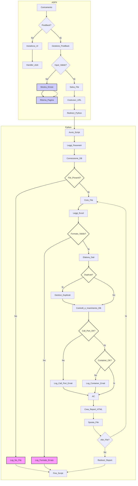

# Flusso Upload Page Diagrams

```mermaid
graph TB
    subgraph ASPX
        A[Caricamento] --> B{PostBack?};
        B -- No --> C[Inizializza_UI];
        C --> D[Handler_click];
        B -- Si --> E[Gestione_PostBack];
        E --> F{Input_Valido?};
        F -- No --> G[Mostra_Errore];
        G --> H[Ritorna_Pagina];
        F -- Si --> I[Salva_File];
        I --> J[Costruisci_URL];
        J --> K[Redirect_Python];
    end

    subgraph Python
        K --> L[Avvio_Script];
        L --> M[Leggi_Parametri];
        M --> N[Connessione_DB];
        N --> O{File_Presenti?};
        O -- No --> P[Log_No_File];
        O -- Si --> Q[Ciclo_File];
        Q --> R[Leggi_Excel];
        R --> S{Formato_Valido?};
        S -- No --> T[Log_Formato_Errato];
        S -- Si --> U[Elabora_Dati];
        U --> V{Duplicati?};
        V -- Si --> W[Gestisci_Duplicati];
        V -- No --> X;
        W --> X[Controlli_e_Inserimento_DB];
        X --> Y{Call_Port_OK?};
        Y -- No --> Z[Log_Call_Port_Errati];
        Y -- Si --> AA{Container_OK?};
        AA -- No --> AB[Log_Container_Errati];
        AA -- Si --> AC;
        Z --> AC;
        AB --> AC;
        AC --> AD[Crea_Report_HTML];
        AD --> AE[Sposta_File];
        AE --> AF{Altri_File?};
        AF -- Si --> Q;
        AF -- No --> AG[Redirect_Report];
        AG --> AH[Fine_Script];
    end

    G --> H;
    P --> AH;
    T --> AH;
    style G fill:#ccf,stroke:#333,stroke-width:2px
    style P fill:#f9f,stroke:#333,stroke-width:2px
    style T fill:#f9f,stroke:#333,stroke-width:2px
    style H fill:#ccf,stroke:#333,stroke-width:2px
    style O fill:#ffd,stroke:#333,stroke-width:2px
    style S fill:#ffd,stroke:#333,stroke-width:2px
    style V fill:#ffd,stroke:#333,stroke-width:2px
    style Y fill:#ffd,stroke:#333,stroke-width:2px
    style AA fill:#ffd,stroke:#333,stroke-width:2px

    linkStyle 0,1,2,3,4,5,6,7,8,9,10,11,12,13,14,15,16,17,18,19,20,21,22,23,24,25,26,27,28,29,30,31 stroke:#333,stroke-width:1.5px;
```

