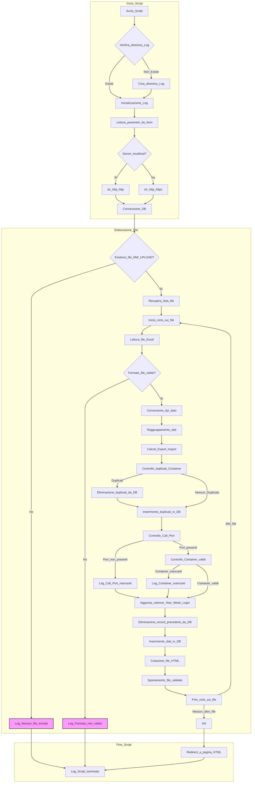

# Python Excel Validate Diagrams

```mermaid
graph TB
    subgraph Inizio_Script
        A[Avvio_Script] --> B{Verifica_directory_Log};
        B -- Esiste --> C[Inizializzazione_Log];
        B -- Non_Esiste --> D[Crea_directory_Log];
        D --> C;
        C --> E[Lettura_parametri_da_form];
        E --> F{Server_localhost?};
        F -- Si --> G[str_http_http];
        F -- No --> H[str_http_https];
        G --> I[Connessione_DB];
        H --> I;
    end

    subgraph Elaborazione_File
        I --> J{Esistono_file_MW_UPLOAD?};
        J -- No --> K[Log_Nessun_file_trovato];
        J -- Si --> L[Recupera_lista_file];
        L --> M[Inizio_ciclo_sui_file];
        M --> N[Lettura_file_Excel];
        N --> O{Formato_file_valido?};
        O -- No --> P[Log_Formato_non_valido];
        O -- Si --> Q[Conversione_tipi_dato];
        Q --> R[Raggruppamento_dati];
        R --> S[Calcoli_Export_Import];
        S --> T[Controllo_duplicati_Container];
        T -- Duplicati --> U[Eliminazione_duplicati_da_DB];
        U --> V[Inserimento_duplicati_in_DB];
        T -- Nessun_Duplicato --> V;
        V --> W[Controllo_Call_Port];
        W -- Port_non_presenti --> X[Log_Call_Port_mancanti];
        W -- Port_presenti --> Y[Controllo_Container_validi];
        Y -- Container_mancanti --> Z[Log_Container_mancanti];
        Y -- Container_validi --> AA[Aggiunta_colonne_Year_Week_Login];
        Z --> AA;
        X --> AA;
        AA --> AB[Eliminazione_record_precedenti_da_DB];
        AB --> AC[Inserimento_dati_in_DB];
        AC --> AD[Creazione_file_HTML];
        AD --> AE[Spostamento_file_validato];
        AE --> AF[Fine_ciclo_sui_file];
        AF -- Altri_file --> M;
        AF -- Nessun_altro_file --> AG;
    end

    subgraph Fine_Script
        AG --> AH[Redirect_a_pagina_HTML];
        AH --> AI[Log_Script_terminato];
    end

    K --> AI;
    P --> AI;

    style K fill:#f9f,stroke:#333,stroke-width:2px
    style P fill:#f9f,stroke:#333,stroke-width:2px
    linkStyle 0,1,2,3,4,5,6,7,8,9,10,11,12,13,14,15,16,17,18,19,20,21,22,23,24,25,26,27,28,29,30,31,32,33,34,35,36,37,38,39,40,41 stroke:#333,stroke-width:1.5px;
```
[Back to top](#project-diagrams)
