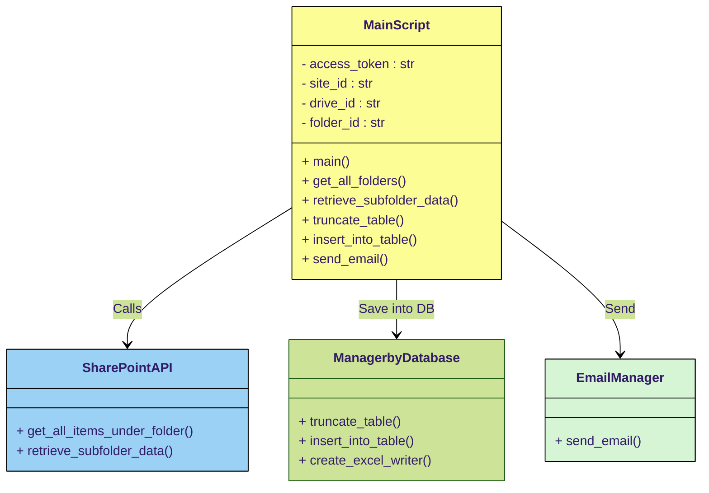

# MSC Italy - SharePoint Site

Questo documento illustra come, partendo dal **sito SharePoint MSC Italy**, sia possibile documentare tutte le cartelle contenute al suo interno.

---

## Schema Generale del flusso

