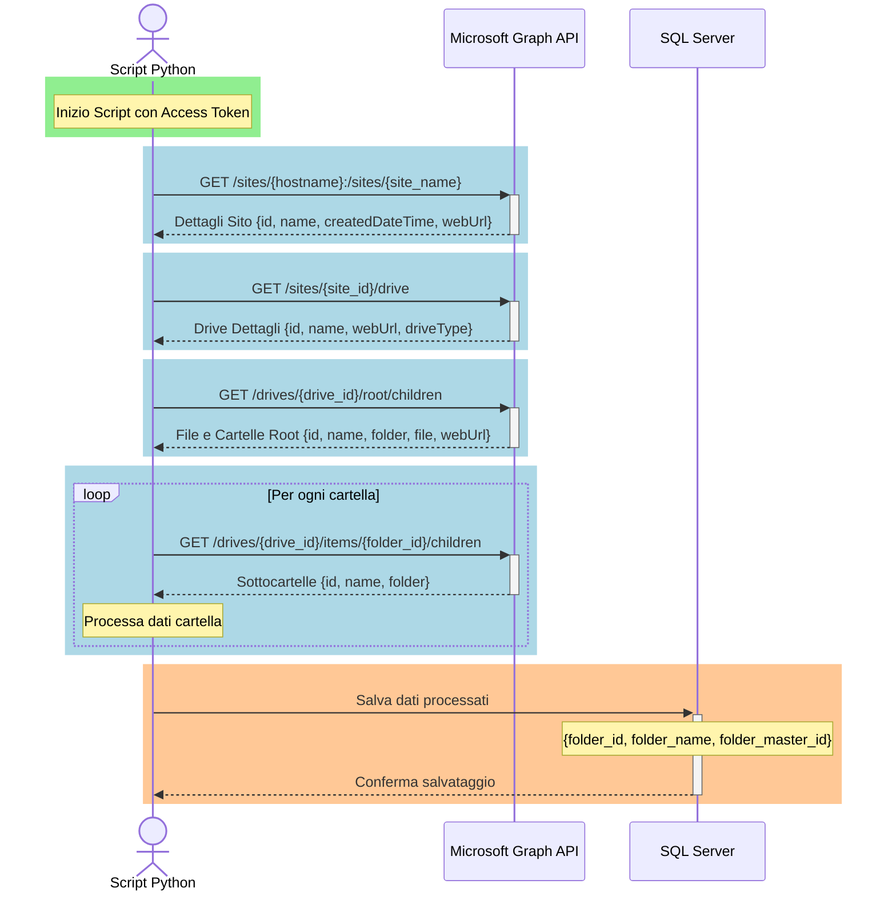

# MSC Italy - SharePoint Site - Diagramma di Flusso

Questo documento illustra come, partendo dal **sito SharePoint MSC Italy**, 
 sia possibile documentare tutte le cartelle contenute al suo interno usando  lo script PYTHON:   **docum_folders_SH.pyw**.
 

---

## Schema Generale delle chiamate a Microsoft Graph API

